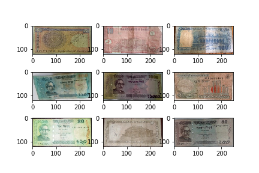

# Bangla-Money-Dataset

Nine Bangladeshi Banknote Data.
Each image is ( 120, 250, 3 ) pixels.

### Credits:
This data was created in 2018 for a project named "Bangla Taka Recognition" by Tahmida Akther, Tasnim Begum and Mst. Fahmida Begum under supervision of Noushad Sojib as the final year project. 
